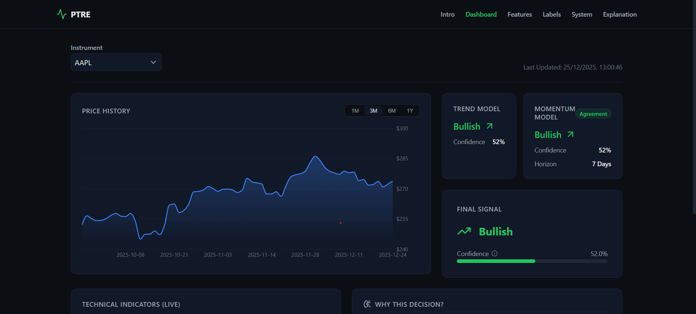
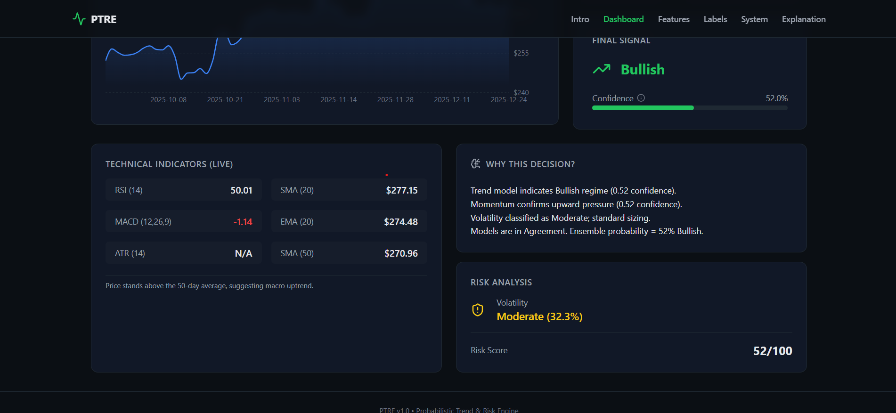
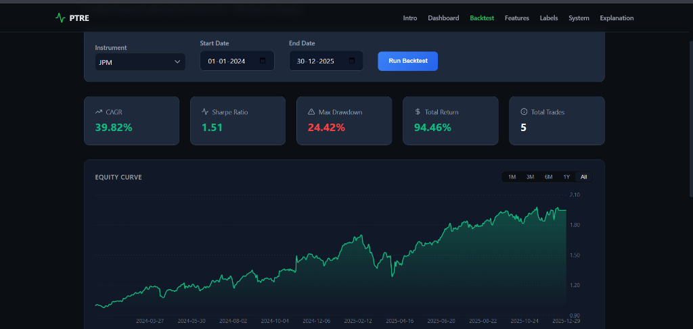

## PTRE
# PTRE: Predictive Trend & Risk Engine

**An Institutional-Grade Quantitative Trading Dashboard.**


*(Top: Dynamic Price History, Trend & Momentum Models, Signal Agreement Badges)*


*(Bottom: Technical Indicators, Explainability Engine, and Risk Analysis)*

---

## Overview

**PTRE** is a specialized financial analytics platform designed to detect high-probability market regimes. Unlike standard technical analysis tools, PTRE uses a **Dual-Model Ensemble** approach (Trend + Momentum) with a strict volatility-gating mechanism to generate signals with calibrated probabilities.

It answers three critical questions for any asset:
1.  **What is the Regime?** (Bullish / Bearish / Neutral)
2.  **How confident are we?** (Calibrated Probability %)
3.  **Is it safe to trade?** (Volatility Risk Score)

---

## Key Features

### Dual-Model Architecture
* **Trend Model**: Uses **Histogram-Based Gradient Boosting** to learn non-linear relationships across ~40 engineered features.
* **Momentum Model**: A fast-reacting verification layer using 11 velocity and volume-based indicators.

### Risk-First Design
* **Ensemble Soft-Gating**: Signals require agreement. Conflicts apply confidence penalties.
* **Neutral Zone Detection**: Automatically identifies high-volatility chop where signals are unreliable.

### Institutional UI
* Dynamic multi-timeframe filtering  
* Explainability engine (human-readable ML outputs)  
* Live RSI, SMA, EMA, MACD, ATR  

### Strategy Backtester
* Full historical simulation  
* CAGR, Sharpe, drawdown  
* Equity curve visualization  



---

## Technology Stack

**Frontend**
- React (Vite)
- CSS Modules
- Recharts
- Lucide

**Backend**
- Python (FastAPI)
- Pandas / NumPy
- Scikit-Learn
- Joblib

---

## How This Project Works

This repository follows **production-grade ML design**.

GitHub stores:
- Model code
- Feature engineering
- Pipelines
- API & UI

Your machine generates:
- Raw price data  
- Processed features  
- Labels  
- Trained models  

These are **not stored in Git** — they are **reproducible artifacts**.

---

## Reproducing the System From Scratch

When someone clones this repository, there will be **no data and no models**.  
This is intentional.

To rebuild everything:

```bash
pip install -r requirements.txt
python scripts/update_and_train.py